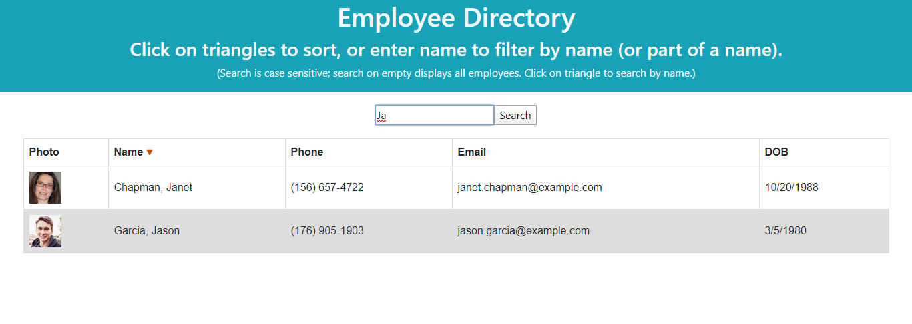
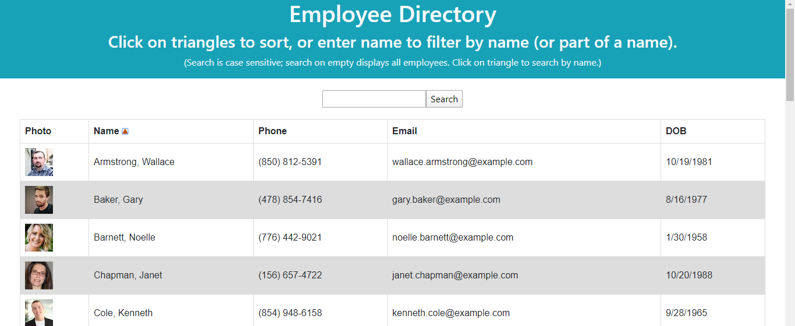
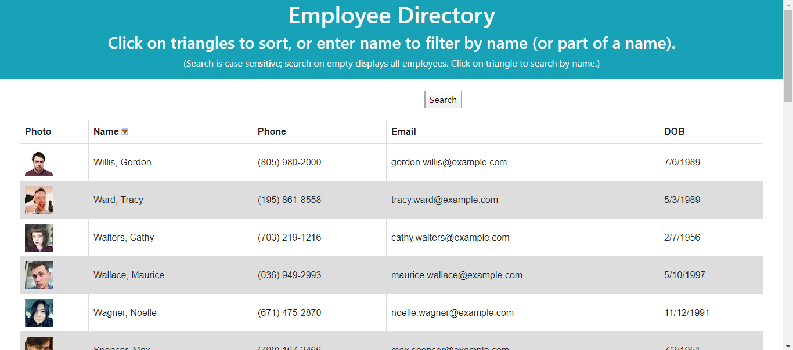

# Employee Directory with React
Github repository: [https://github.com/MauraSlavin/employeedir](https://github.com/MauraSlavin/employeedir).  
Deployed app on Heroku: [https://employee-directory-mms.herokuapp.com/](https://employee-directory-mms.herokuapp.com/).

## Brief description

The Employee Directory loads random names and information from https://randomuser.me using React class-based components.
Users can search for an employee by name, sort the employees alphabetically, or do a reverse-alphabetic search.

This project was bootstrapped with [Create React App](https://github.com/facebook/create-react-app).

## User story

As a manager, it would be helpful to have quick access to all my employess and sort by name and search by name.

## Functionality

Enter a name or partial name and hit enter (or click "Search") to get a list of names that match.

Clicking the  next to the "Name" column header will sort the employees in alphabetical order, and change the  to an :

Clicking on the  will then sort in reverse alphabetical order, and change the  back to an :

### NOTE:

Re-loading the page, or re-starting the app will load a new random list of employees.

## Technologies used

    - React
    - Axios
    - Bootstrap
    - Html
    - CSS